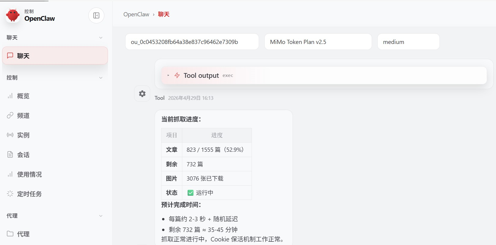
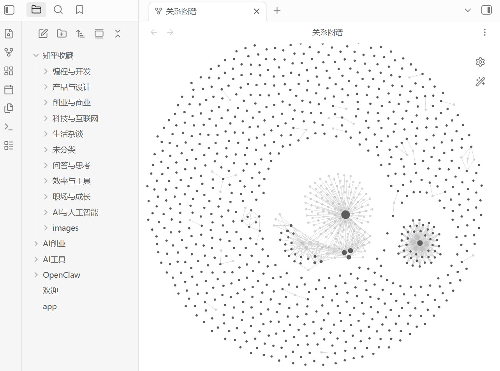

<div align="center">

# Zhihu Fetcher Skill

> From your **Zhihu collection list** to **bulk article bodies and images**, all the way to **automatic categorization into Obsidian**: multi-tier API / Playwright fallback, persistent Cookie context with keep-alive, and resume-from-checkpoint support.

[](LICENSE)
[](https://www.python.org/)
[](https://playwright.dev/)
[](https://agentskills.io)

<br>

Got thousands of saved articles you want to **archive as Markdown**?<br>
Need **local image copies**, with the ability to **resume interrupted runs**?<br>
Want to land everything in Obsidian and have it **auto-categorized by topic**?<br>
Tired of Cookies expiring — want a **persistent context with keep-alive**?

**This Skill orchestrates the full pipeline following the AgentSkills convention. The entry point is [`SKILL.md`](SKILL.md) at the repo root; all scripts live under `scripts/`.**

[Features](#features) · [Installation](#installation) · [Usage](#usage) · [Project Structure](#project-structure) · [Screenshots](#screenshots) · [References](#references)

</div>

---

## Features

| Capability | Description |
|------------|-------------|
| Collection list | `fetch_zhihu_collection.py` — tries the API first, falls back to Playwright DOM scraping on failure; outputs a JSON list |
| Personal history list | `fetch_zhihu_history.py` — likes/saves from a user's profile page; supports date ranges, resume-from-checkpoint, and interaction-time metadata |
| Bulk fetch | `fetch_zhihu_batch.py` — article body as Markdown, images written to `{output_dir}/images/` by default, `_progress.json` for checkpointing, automatic retry on failure, API fallback |
| Formatting | `format_articles.py` — conservative cleanup of export artifacts (code-block recovery + language inference, link-card / link-list restoration, redirect decoding, blank-line normalization); optionally syncs file mtime to `interaction_time` |
| Cookie | Persistent browser context + periodic keep-alive; use `zhihu_relogin.py` to re-authenticate when the session expires |
| Single-article / debug | `fetch_zhihu.py`, `fetch_zhihu_api.py`, `fetch_zhihu_stealth.py`, `fetch_zhihu_interactive.py`, and other entry points |
| Obsidian | `write_to_obsidian.py` — Vault detection, smart categorization against an existing "Zhihu Collection" structure, image sync; `write_zhihu_history_to_obsidian.py` supports URL-deduplicated import for history items |

**Dependencies**: see [`scripts/requirements.txt`](scripts/requirements.txt); also run `playwright install chromium`.

---

## Installation

### Claude Code / Cursor

Place this repository at the skills path expected by your host (the directory containing [`SKILL.md`](SKILL.md) is the skill root). After restarting, confirm the skill appears in your rules or skill list.

```bash
# Example: clone into the project's skills directory
mkdir -p .cursor/skills
git clone https://github.com/handsomestWei/zhihu-fetch-skill.git .cursor/skills/zhihu-fetch-skill
```

### Dependencies

```bash
cd scripts
pip install -r requirements.txt
playwright install chromium
```

---

## Usage

Describe what you want in plain language to the Agent — keywords like "Zhihu article", "collection", "bulk fetch", "write to Obsidian", or "Cookie expired" are enough to trigger the right flow.

Typical four-step pipeline (adjust `{workspace}` paths for your machine; see [`SKILL.md`](SKILL.md) for full details):

```bash
# 1. Collection → JSON list
python scripts/fetch_zhihu_collection.py <collection_url_or_id>

# 2. Bulk-fetch article bodies and images
python scripts/fetch_zhihu_batch.py <list.json>

# 3. Conservative formatting (recommended: preview first with --dry-run --diff)
python scripts/format_articles.py <articles_dir>

# 4. Write to Obsidian Vault (Vault path optional)
python scripts/write_to_obsidian.py <articles_dir> [vault_path]
```

Personal history (likes / saves) example:

```bash
# 1. User activity → JSON list (start inclusive, end exclusive)
python scripts/fetch_zhihu_history.py \
  https://www.zhihu.com/people/<slug> \
  2026-01-01T00:00:00+01:00 \
  runtime/zhihu_history_2026-01-01_to_2026-04-05.json \
  --until 2026-04-05T00:00:00+02:00

# 2. Bulk-fetch article bodies and images (auto-retries up to 3 times on failure)
python scripts/fetch_zhihu_batch.py \
  runtime/zhihu_history_2026-01-01_to_2026-04-05.json \
  runtime/zhihu_articles_history_2026-01-01_to_2026-04-05

# 3. Conservative formatting; sync file mtime to interaction_time
python scripts/format_articles.py \
  runtime/zhihu_articles_history_2026-01-01_to_2026-04-05 \
  --set-times

# 4. Write into Obsidian under "Zhihu Collection/{category}/", deduplicating by URL
python scripts/write_zhihu_history_to_obsidian.py \
  runtime/zhihu_articles_history_2026-01-01_to_2026-04-05 \
  /path/to/ObsidianVault \
  .
```

The Obsidian root folder defaults to `Zhihu Collection` and the failures file to `fetch_failures.md`. Both are configurable via `--root-folder` / `--failures-name` flags or the `ZHIHU_OBSIDIAN_ROOT` / `ZHIHU_FAILURES_FILE` environment variables. To restore the original Chinese layout, set `ZHIHU_OBSIDIAN_ROOT=知乎收藏`.

When the Cookie session is broken:

```bash
python scripts/zhihu_relogin.py
```

---

## Project Structure

This repo follows the [AgentSkills](https://agentskills.io) convention — the root directory is itself a skill:

```
zhihu-fetch-skill/
├── SKILL.md                 # Skill entry point: triggers, commands, and path conventions
├── README.md                # This file
├── LICENSE
├── .gitignore
├── docs/                    # Documentation images (screenshots)
│   ├── openclaw-run.jpg
│   └── obs.jpg
└── scripts/
    ├── requirements.txt
    ├── fetch_zhihu_collection.py
    ├── fetch_zhihu_history.py
    ├── fetch_zhihu_batch.py
    ├── fetch_zhihu.py
    ├── fetch_zhihu_api.py
    ├── fetch_zhihu_stealth.py
    ├── fetch_zhihu_interactive.py
    ├── format_articles.py
    ├── write_to_obsidian.py
    ├── write_zhihu_history_to_obsidian.py
    ├── write_zhihu_failures.py
    ├── zhihu_login.py
    ├── zhihu_login_save.py
    └── zhihu_relogin.py
```

Default output paths and other behavior are governed by the "Bulk Fetch Details" and "File Paths" sections in [`SKILL.md`](SKILL.md).

---

## Screenshots

**Bulk fetch running inside an OpenClaw conversation** (tool output shows progress, remaining article count, image count, and Cookie keep-alive status)



**Vault structure after writing to Obsidian** ("Zhihu Collection" with topic sub-folders and graph view)



---

## References

- [Skill entry point and full command reference](SKILL.md) (dependencies, script table, troubleshooting)
- [Script dependency list](scripts/requirements.txt)

---

<div align="center">

MIT License © [handsomestWei](https://github.com/handsomestWei/)

</div>
